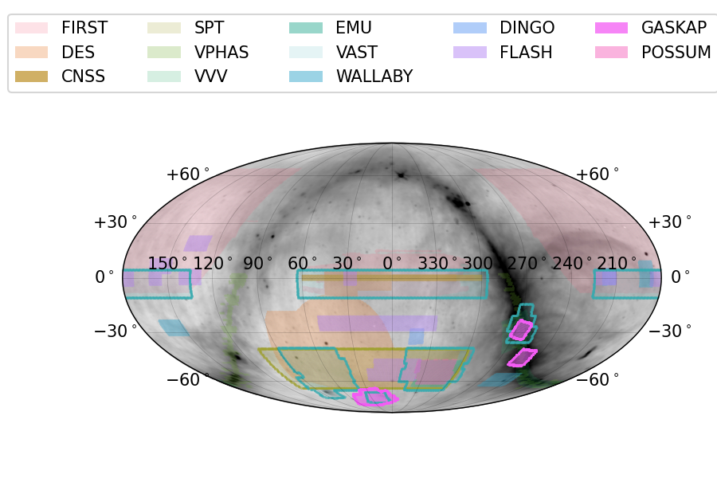

# askap_surveys

Basic parameters for ASKAP surveys to aid coordination.


See [Examples](examples/EXAMPLES.md) for further examples


## Requirements (beyond standard)

* [skymapper](https://github.com/marxide/skymapper) - this is a fork of the [original](https://github.com/pmelchior/skymapper) that includes speedups
* [mocpy](https://cds-astro.github.io/mocpy/)
* [pymangle](https://github.com/esheldon/pymangle)
* [pygsm](https://github.com/telegraphic/PyGSM)
* [healpy](https://healpy.readthedocs.io)

These are included in [`requirements.txt`](requirements.txt)

## Installation

We strongly recommend using a virtual environment, e.g. conda. This package depends on `healpy` which requires the HEALPix C++ libraries. `pip` will try to compile these for your machine, but there are reports of this failing for many users. It is safer to use the binary installations from conda-forge.

Within a conda environment, clone this repository, install the requirements, then install this package:

`pip install -r requirements.txt`

`pip install .`

## Survey information sources:

Format for each ASKAP survey tile description (largely taken from confluence pages like <https://confluence.csiro.au/display/askapsst/EMU>):

```
Name,RA,Dec,Footprint,Pitch,Rotation,Frequency,Interleaved
EMU_2059-51, 21:00:00.000, -51:07:06.39, closepack36, 0.9, 45.0, 943.491, No
EMU_2034-60, 20:34:17.142, -60:19:18.17, closepack36, 0.9, 45.0, 943.491, No
EMU_2042-55, 20:42:00.000, -55:43:29.41, closepack36, 0.9, 45.0, 943.491, No
EMU_2115-60, 21:15:25.714, -60:19:18.17, closepack36, 0.9, 45.0, 943.491, No
EMU_2132-51, 21:32:43.636, -51:07:06.39, closepack36, 0.9, 45.0, 943.491, No
EMU_2027-51, 20:27:16.363, -51:07:06.39, closepack36, 0.9, 45.0, 943.491, No
EMU_2118-55, 21:18:00.000, -55:43:29.41, closepack36, 0.9, 45.0, 943.491, No
EMU_2154-55, 21:54:00.000, -55:43:29.41, closepack36, 0.9, 45.0, 943.491, No
EMU_2156-60, 21:56:34.285, -60:19:18.17, closepack36, 0.9, 45.0, 943.491, No
EMU_2205-51, 22:05:27.272, -51:07:06.39, closepack36, 0.9, 45.0, 943.491, No
```

Each survey ([DINGO](https://confluence.csiro.au/display/askapsst/DINGO), [EMU](https://confluence.csiro.au/display/askapsst/EMU), [FLASH](https://confluence.csiro.au/display/askapsst/FLASH), [GASKAP](https://confluence.csiro.au/display/askapsst/GASKAP), [POSSUM](https://confluence.csiro.au/display/askapsst/POSSUM), [VAST](https://confluence.csiro.au/display/askapsst/VAST), [WALLABY](https://confluence.csiro.au/display/askapsst/WALLABY)) has a `CSV` file as well as a `MOC`.  The latter can be loaded into [aladin](https://aladin.u-strasbg.fr) as well.

## Scripts

The following scripts will be installed into your path:

* `askap_field_to_moc`: convert an ASKAP survey `CSV` file to a `MOC` and a ds9 regions file. **NOTE:** this is preliminary and doesn't correctly use frequency/footprint/pitch information. Usage:

```
askap_field_to_moc --fields=VAST.csv --moc=VAST.MOC.fits --reg=VAST.reg
```

* `sky_coverage_plot`: take all of the provided surveys and overplot them on the GSM sky image. This script is currently supplied largely as a working example . You may write your own plotting script that follows this example (the source is in `askap_surveys/scripts/sky_coverage_plot.py`) and adjust various parameters (number of surveys shown, colors, ...). Basic CLI: 
```
sky_coverage_plot -h
usage: sky_coverage_plot [-h] [-o OUT] [--askaponly]
                         [-p {Albers,LambertConformal,Equidistant,Hammer,Mollweide,EckertIV,WagnerI,WagnerIV,WagnerVII,McBrydeThomasFPQ,HyperElliptical,Tobler,EqualEarth}]
                         [-m [MAP_OPTIONS [MAP_OPTIONS ...]]]

optional arguments:
  -h, --help            show this help message and exit
  -o OUT, --out OUT     Output name for plot (default: test.pdf)
  --askaponly           Only include the ASKAP surveys (default: False)
  -p {Albers,LambertConformal,Equidistant,Hammer,Mollweide,EckertIV,WagnerI,WagnerIV,WagnerVII,McBrydeThomasFPQ,HyperElliptical,Tobler,EqualEarth}, --projection {Albers,LambertConformal,Equidistant,Hammer,Mollweide,EckertIV,WagnerI,WagnerIV,WagnerVII,McBrydeThomasFPQ,HyperElliptical,Tobler,EqualEarth}
                        Projection type (default: Mollweide)
  -m [MAP_OPTIONS [MAP_OPTIONS ...]], --map_options [MAP_OPTIONS [MAP_OPTIONS ...]]
                        Additional map projection arguments as key=value pairs
                        (e.g., 'lon_0=180', ...). See https://github.com/pmelc
                        hior/skymapper/blob/master/skymapper/projection.py
                        (default: None)
```
Users can change the output filename (and type), whether only ASKAP surveys are plotted (default = ASKAP + others), the map projection (default = Mollweide), and certain map projection parameters.

## Included surveys

MOC FITS files are provided for the following surveys. To access them for your own needs, simply import this package and access the MOC register which maps the survey names to the path to the MOC file. For example, to access the VAST MOC:

```python
import askap_surveys
vast_moc_path = askap_surveys.moc_register["VAST"]
```

To see a list of registered MOC files, inspect the contents of `askap_surveys.moc_register` dict, e.g.

```python
import askap_surveys
print(askap_surveys.moc_register.keys())
```

The provided MOCs are also listed below.

### ASKAP pilot surveys

* DINGO
* EMU
* FLASH
* GASKAP
* POSSUM
* VAST
  * Also has each epoch of VAST separately, generated by Emil Lenc (e.g., https://www.atnf.csiro.au/people/Emil.Lenc/HiPS/VAST1_I4)
* WALLABY

### Other

* FIRST: coverage maps from <http://sundog.stsci.edu/first/catalogs/readme.html#coverage>
* DES: mangle file from <http://www.mpe.mpg.de/~tdwelly/erosita/multiwavelength_coverage/>
* SPT: rough parameters read off plot from Story et al. 2013, <https://iopscience.iop.org/article/10.1088/0004-637X/779/1/86/pdf>
* VPHAS-DR3: <http://horus.roe.ac.uk/vsa/coverage-maps.html>
* VVV-DR5: <http://horus.roe.ac.uk/vsa/coverage-maps.html>
