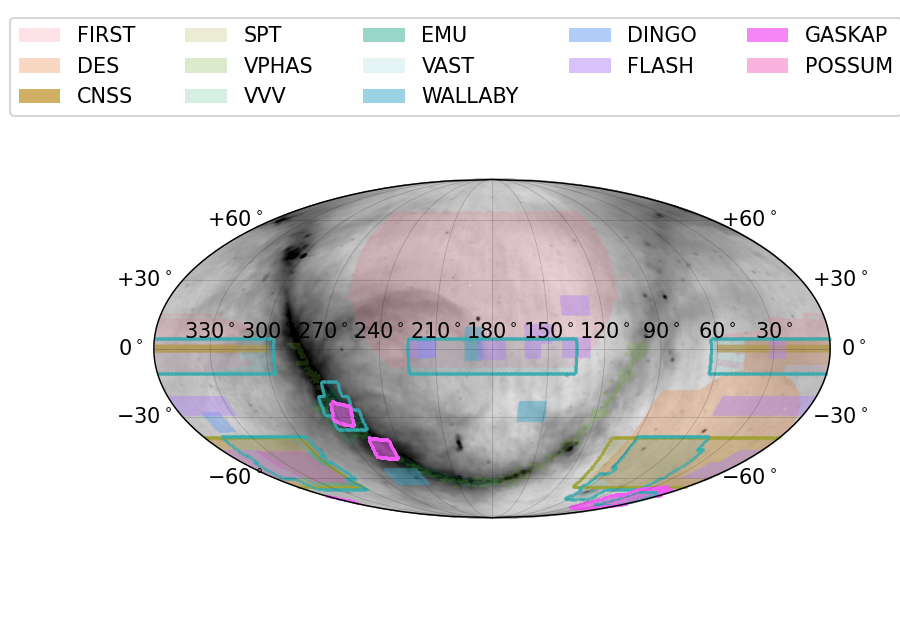
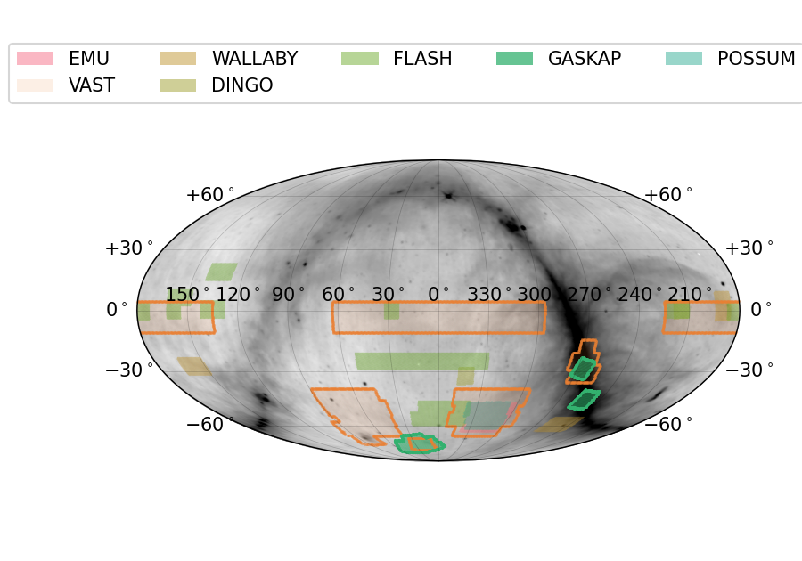
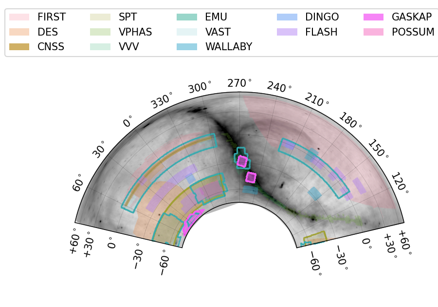

* `sky_coverage_plot  -o default.png`: default

* `sky_coverage_plot -m "lon_0=180" -o Mollweide_180d.png`: make a Mollweide projection centered at RA=180d

* `sky_coverage_plot --askaponly -o askaponly.png`: Only plot the ASKAP surveys

* `sky_coverage_plot --projection=Albers -o galactic_center.png -m lon_0=270 lat_0=-27 lat_1=-47 lat_2=-7`: make an Albers projection centered roughly on the Galactic Center

